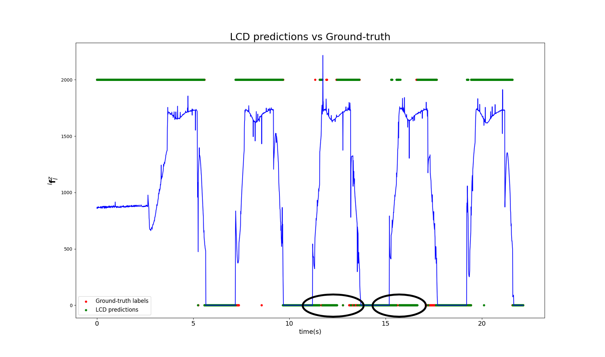

# LCD

LCD is a quality of contact estimation supervised deep learning framework for legged robots. It utilizes Force/Torque and IMU measurements to predict the probability of Stable Contact (SC) and Unstable Contact (UC). LCD also works with reduced features (Fz + IMU) in case the robot has point feet but the results are slightly worse on datasets with extremely low friction coefficient surfaces (< 0.07). Additionally, LCD generalizes across platforms, meaning it can predict the quality of contact on gaits of robot A even thought it was trained using data from that particular robot.

## Provided Datasets

The datasets (.csv) provided are self explanatory. Name of robot + number of samples + friction coeff. In the "mixed friction" datasets, the fiction coefficient varies from 0.03 to 1.2. The labels are either 0 (stable contact), 1 (no_contact) and 2 (slip). Labels 1 and 2 are merged into one class by LCD as UC. These samples were collected from the raisim simulated environment and the labels were extracted by using the force and also by utilizing the ground-truth 3D spatial linear and angular velocity of the foot. Each dataset consists of omni-directional walking gaits of the named robot with a sampling rate of 100 Hz.

## Requirements

To train, deploy, and visualize an LCD model the following requirements must be met:

* [pytorch](https://pytorch.org/get-started/locally/)
* pip install tensorboard
* pip install scipy-learn
* pip install pandas
* pip install matplotlib
* git clone https://github.com/mrsp/lcd_core.git

## Training and Testing procedure

Initiate a training and testing loop with:

`python train.py --train-dataset-csv=training_dataset.csv --test-dataset-csv=testing_dataset.csv --epochs=10`

## Training and Testing results with tensorboard

After training one can visualize training and testing performance metrics with  

`tensorboard --logdir .\runs`

Indicative training on the `ATLAS_50k_mixedFriction` dataset is illustrated below where the accuracy
and loss are shown:

In addition, the confusion matrix is depicted for testing on the `ATLAS_21k_02ground` dataset:

## Results

Walking in extremely low coefficient surface scenarios causes the robot to slip but since it transfers its weight to the slipping foot, the vertical ground reaction force is high-valued and thus mainstream algorithms for predicting the contact state fail.

The prediction of LCD on an experiment with an ATLAS robot walking on a surface with friction coefficient below 0.1 are represented in the following figure. The top labels mean stable contact and the bottom mean unstable contact (Slip + fly):

The first two steps are on normal friction coefficient and thus the labels behave as expected. Meanwhile the third and forth steps are when the robot slips even though the GRF values are the same as before.

## Reference

For more information regarding LCD kindly check our IROS 2022 paper:
[Robust Contact State Estimation in Humanoid Walking Gaits](
https://ieeexplore.ieee.org/document/9981354)
