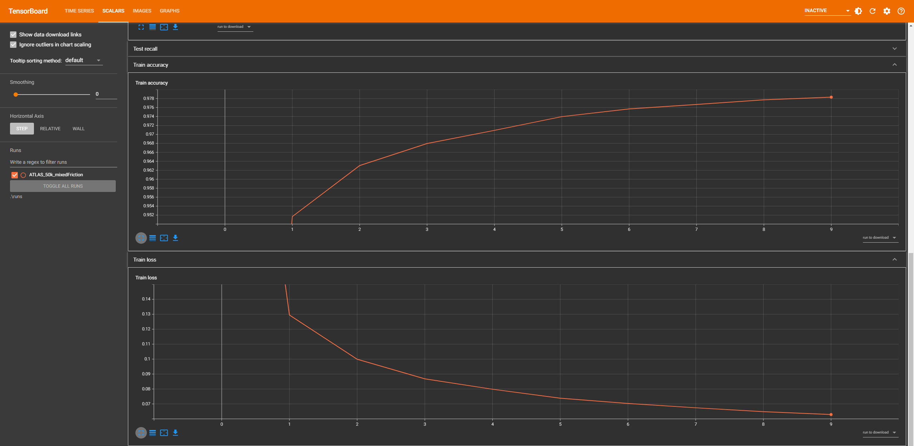
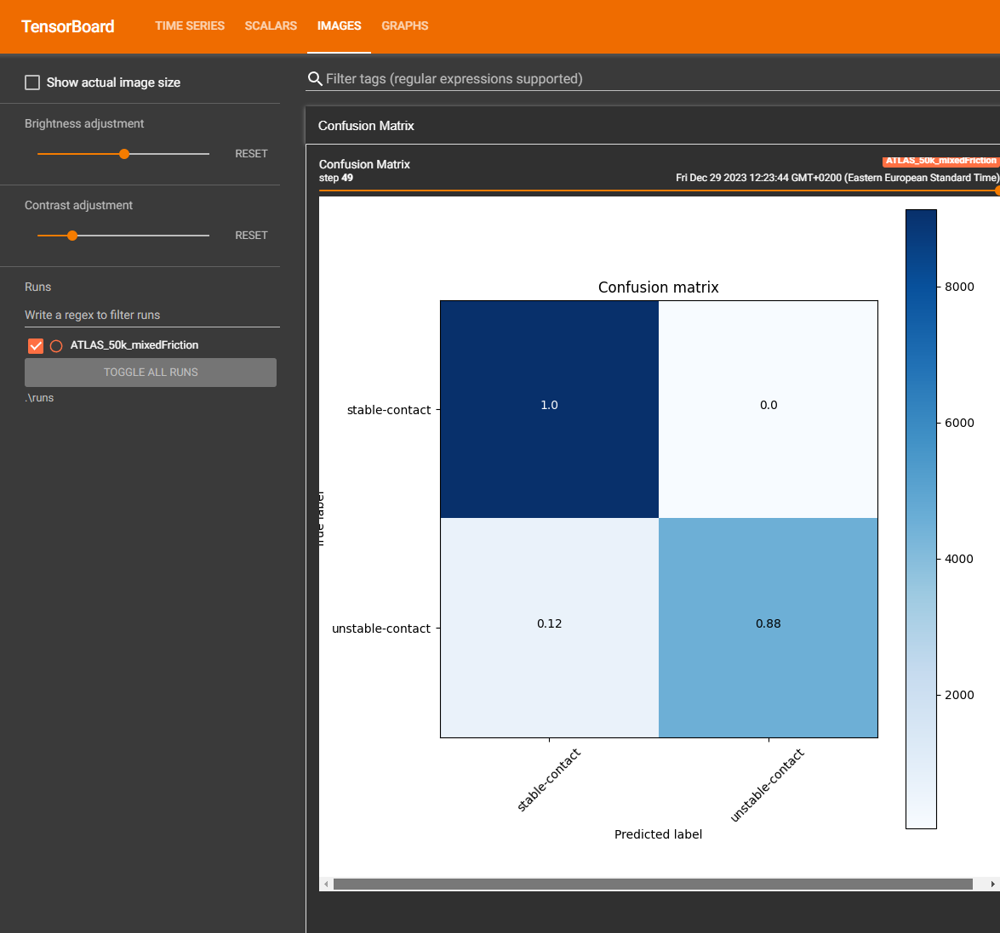
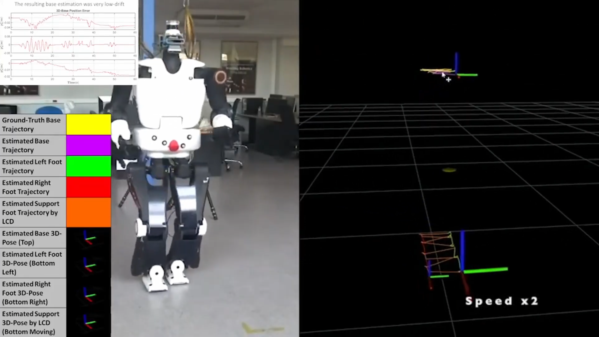

# Legged Contact Detection (LCD)

LCD is a quality of contact estimation supervised deep learning framework for legged robots. It utilizes leg Force/Torque and IMU measurements to predict the probability of Stable Contact (SC) and Unstable Contact (UC). LCD also works with reduced features (Fz + IMU) in case the robot has point feet, nevertheless the results are slightly worse on datasets with extremely low friction coefficient surfaces (< 0.07). Additionally, LCD generalizes across platforms, meaning it is able to predict the quality of contact on walking gaits for a robot even though it was not trained using data from that particular robot. This indicates that LCD learns some platform-invariant features to classify the quality of contact in walking gaits.

## Provided Datasets

The datasets (.csv) provided are self explanatory; name of robot + number of samples + friction coeff. In the "mixed friction" datasets, the friction coefficient varies from 0.03 to 1.2. The labels are either 0 (stable contact), 1 (no contact) and 2 (slip). Labels 1 and 2 are merged into one class by LCD as UC. These samples were collected from a raisim simulated environment and the labels were extracted by utilizing the ground-truth vertical Ground Reaction Force (GRF) and the 3D spatial linear/angular velocity of the foot in contact. Each dataset consists of omni-directional walking gaits of the named robot with a sampling rate of 100 Hz.

## Requirements

To train, deploy, and visualize an LCD model the following requirements must be met:

* [PyTorch](https://pytorch.org/get-started/locally/)
* pip install tensorboard
* pip install scikit-learn
* pip install pandas
* pip install matplotlib
* git clone https://github.com/mrsp/lcd.git

## Training and Testing procedure

Initiate a training and testing loop for example:

`python train.py  --train-dataset-csv=ATLAS_50k_mixedFriction.csv --test-dataset-csv=ATLAS_21k_02ground.csv --epochs=10`

## Visualize Training and Testing results with tensorboard

After training one can visualize training and testing performance metrics with: 

`tensorboard --logdir runs`

Indicative training on the `ATLAS_50k_mixedFriction` dataset is illustrated below where the accuracy
and loss are shown:

In addition, the confusion matrix is depicted for testing on the `ATLAS_21k_02ground` dataset:

## Results

Walking in extremely low coefficient surface scenarios causes the robot to slip. However, since the robot transfers its weight to the slipping foot, the vertical ground reaction force is high-valued and thus typical GRF-based algorithms for predicting the contact state produce inaccurate results.

The predictions of LCD on an experiment with an ATLAS robot walking on a surface with friction coefficient below 0.1 are presented in the following figure. Top labels indicate stable contacts while the bottom ones are the unstable contacts (no contact + slip):

The first two steps are on a surface with normal friction coefficients and thus the predicted labels behave as expected. Subsequently, in the third and fourth steps the robot slips, notice the GRF values are the same as before.

## Reference

For more information regarding the LCD's theory and implementation kindly check our IROS 2022 paper:

[Robust Contact State Estimation in Humanoid Walking Gaits](
https://ieeexplore.ieee.org/document/9981354)

A video presentation is available at:

## License
[MIT](LICENSE)
